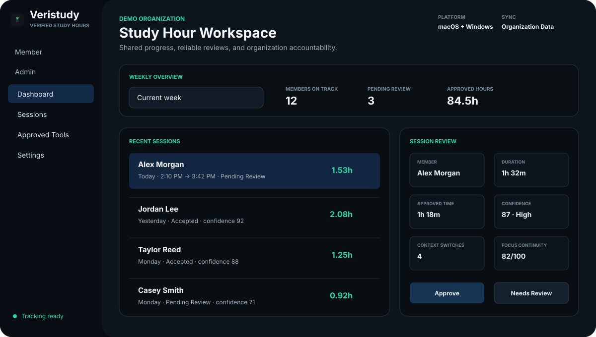
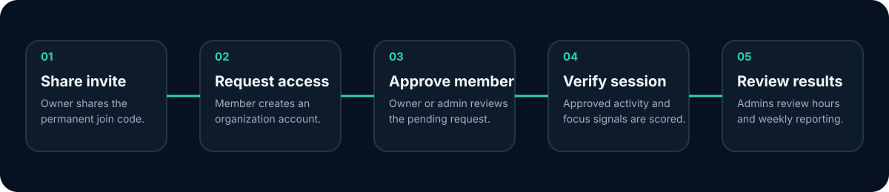
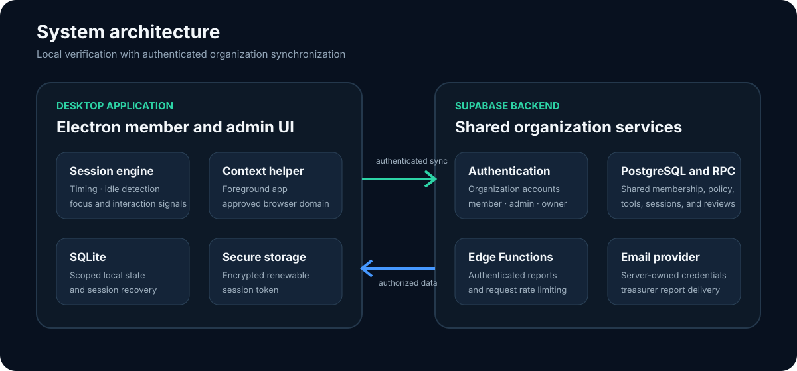

  

<h1 align="center">Veristudy</h1>

  A cross-platform study-hour accountability application for organizations that need more reliable verification than self-reported timers.

  <a href="https://github.com/CooperDonnell/Veristudy-Releases/releases/latest"><strong>Latest desktop release</strong></a>
  ·
  <a href="docs/ARCHITECTURE.md">Architecture</a>
  ·
  <a href="docs/SECURITY_AND_PRIVACY.md">Security and privacy</a>

> [!NOTE]
> This repository is a public product overview and engineering case study. The production source code is maintained in a private repository.

## Product overview

Veristudy helps student organizations manage required study hours without relying entirely on honor-system reporting, location check-ins, or screenshots. Members record sessions from the desktop app, while approved application and website activity provides context for administrative review.

The platform combines a focused member experience with a shared administrative workspace for organization access, session review, approved-tool management, weekly progress, and accountability reporting.

*Illustrative interface overview using fictional demo data. No production member information is shown.*

## Core capabilities

| Area | Capabilities |
| --- | --- |
| Member workflow | Organization joining, account creation, secure remembered sessions, clock in and clock out, and weekly progress |
| Study verification | Approved application and domain activity, idle detection, interaction signals, context switching, and focus continuity |
| Administration | Pending-member approval, member removal, required-hour management, session review, and approved-tool configuration |
| Organization access | One owner, optional administrators, permanent organization join code, and role-restricted management actions |
| Accountability | Weekly completion totals, per-member fine calculations, and treasurer summary reports |
| Distribution | macOS Apple Silicon DMG, Windows x64 installer, and release-based update notifications |

## How it works

1. An owner creates an organization and shares its permanent invite link or join code.
2. A member creates an organization-scoped account and submits a request to join.
3. An owner or administrator approves the request.
4. The desktop app records a study session and classifies approved activity locally.
5. Shared session data is synchronized for administrative review and weekly reporting.

## Engineering highlights

- Built a cross-platform desktop application with Electron and JavaScript.
- Implemented local persistence with SQLite and shared organization data with Supabase.
- Designed organization-scoped authentication with member, administrator, and owner roles.
- Added reviewable session verification using approved contexts, idle behavior, interaction counts, and focus signals.
- Built authenticated server-side weekly reporting and rate limiting with Supabase Edge Functions.
- Created macOS and Windows packaging, release, and update-notification workflows.
- Added automated unit, database-isolation, authentication, security, and session-integrity tests.

## Architecture

Veristudy separates local activity classification from shared organization management. The desktop app records only the metadata needed to evaluate study context, while Supabase provides authentication, role enforcement, shared data, and authenticated reporting.

Read the [architecture overview](docs/ARCHITECTURE.md) for the component responsibilities and data flow.

## Privacy approach

Veristudy is designed to verify study context without reading private content.

It may use:

- foreground application names;
- approved website domains;
- interaction counts and idle status;
- focus duration and context-switch signals.

It does not read:

- webpage or document contents;
- messages or passwords;
- files or keystroke contents;
- browsing history outside the active approved-domain check.

Additional controls include role-restricted organization management, encrypted remembered sessions through operating-system protected storage, authenticated backend requests, server-side report calculation, and rate limiting. See [Security and privacy](docs/SECURITY_AND_PRIVACY.md).

## Technology

- Electron and JavaScript
- SQLite through `better-sqlite3`
- Supabase Authentication, PostgreSQL, RPCs, and Edge Functions
- Native macOS and Windows activity-context integrations
- Node.js automated testing

## Platform availability

| Platform | Distribution |
| --- | --- |
| macOS | Apple Silicon DMG |
| Windows | x64 per-user installer with Desktop and Start Menu shortcuts |

The current builds are unsigned. Operating systems or security software may therefore display additional confirmation prompts during installation. The [release page](https://github.com/CooperDonnell/Veristudy-Releases/releases/latest) publishes SHA-256 digests for integrity verification.

## Project status

Veristudy is under active development and field testing. This public repository documents the product and engineering work while keeping the production implementation and operational configuration private.

## Author

Built by [Cooper Donnell](https://github.com/CooperDonnell).
